# Gisholics Website
## Overview

The Gisholics Portfolio Website is a PHP-based web application serving as a portfolio with various functionalities. The website includes a registration and login system, a CMS (Content Management System) Admin panel, a blog area, a post area, and a Leaflet web map application for the GIS (Geographic Information System) sector. The technology stack comprises PHP 8.1, HTML, CSS, and JavaScript, with PostgreSQL as the database.

## Usage

  - Visit Gisholics Portfolio for a quick glance
    
          http://gisholics.com
    
## Website Sections

  - Registration Form
  - Login Form
  - Forgot Password

## Web Map Application

  - Main Index
  - Post Area
  - Blog Area
  - CMS Admin Panel

## Future Development

    Authentication Requests:
        Additional authentication features will be implemented.

    GIS Sector:
        Development and integration of the GIS sector with more features.

    Admin Panel Enhancements:
        Further functionalities and improvements for the Admin panel.

Registration form

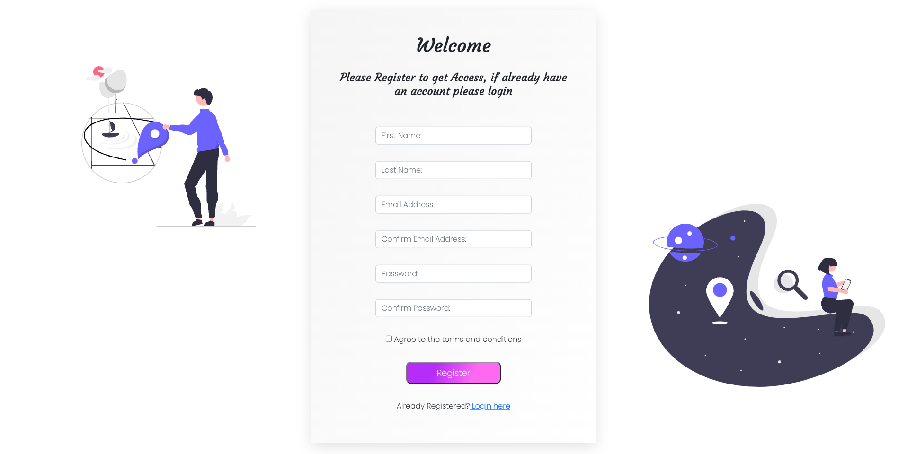

Login form

Forgot password 

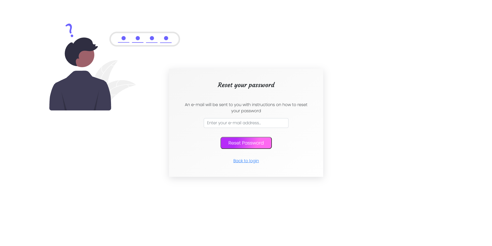

Main index

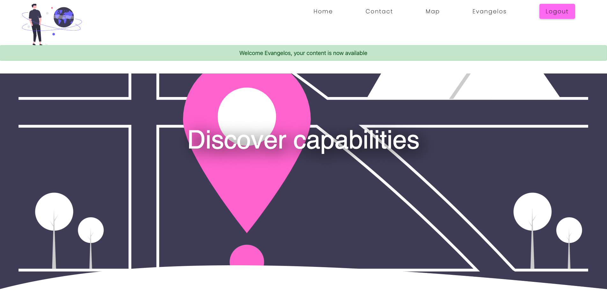

Web Map Application

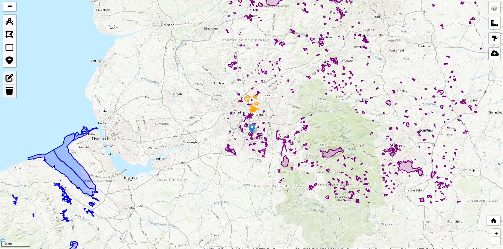

Web Map Application

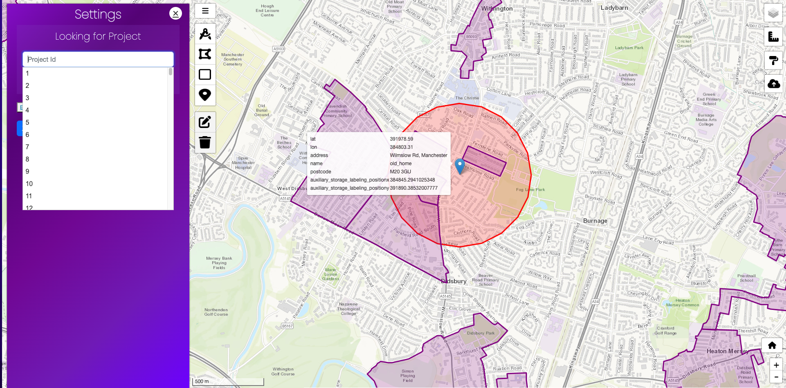

Post Area for users

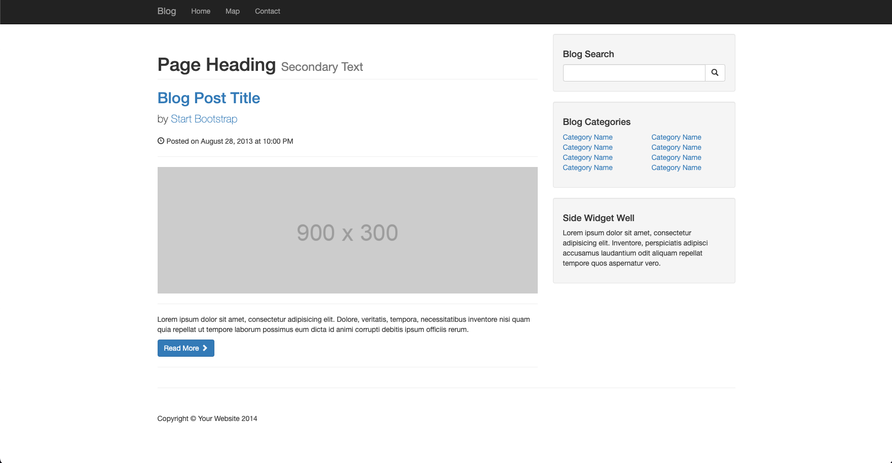

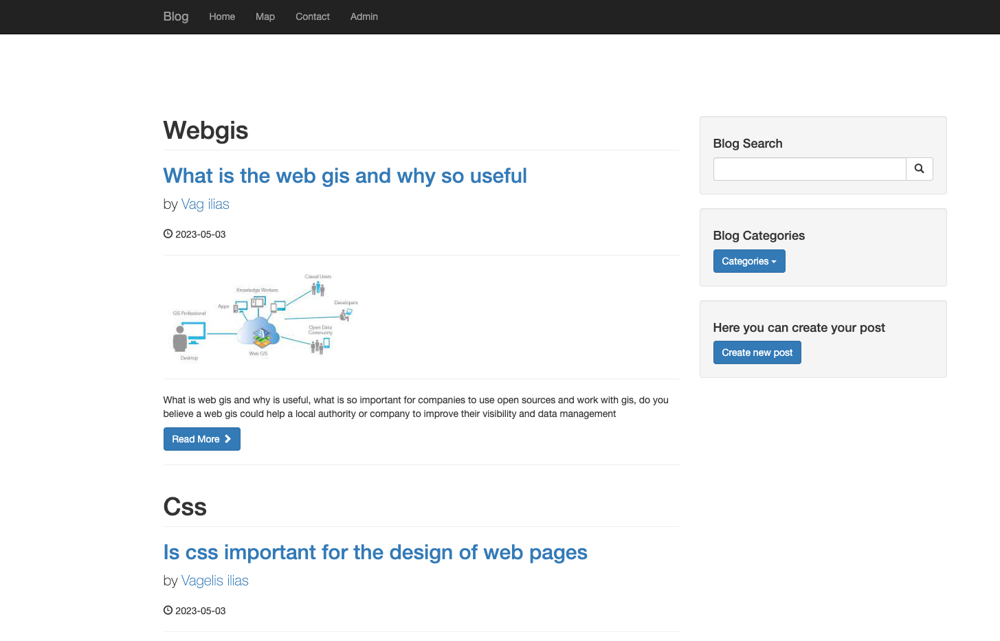

Blog Area

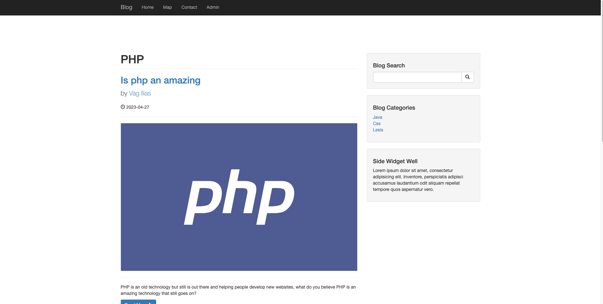

CMS Admin Panel
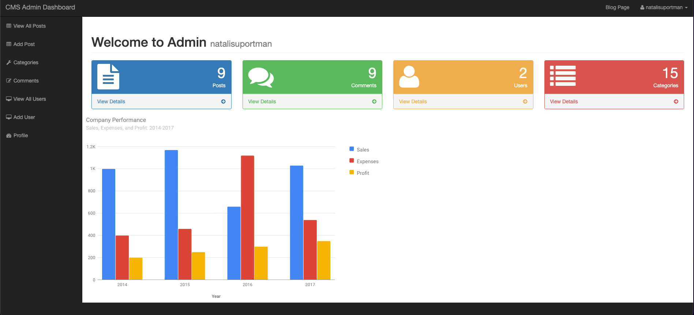

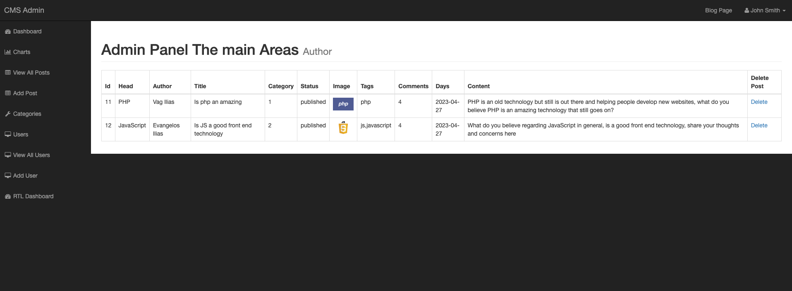

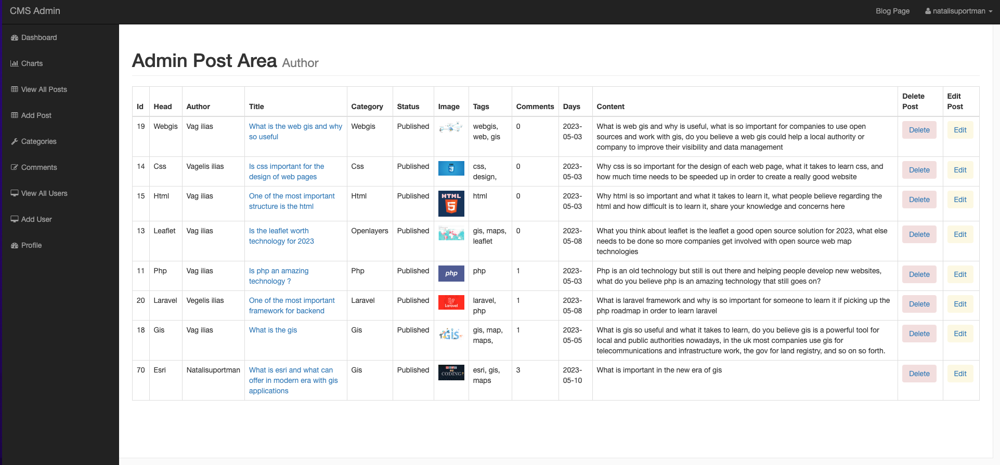

## Customization

  - Feel free to download the project and make any amendments based on your requirements.

## License

  - This project is licensed under the [MIT License](LICENSE).

